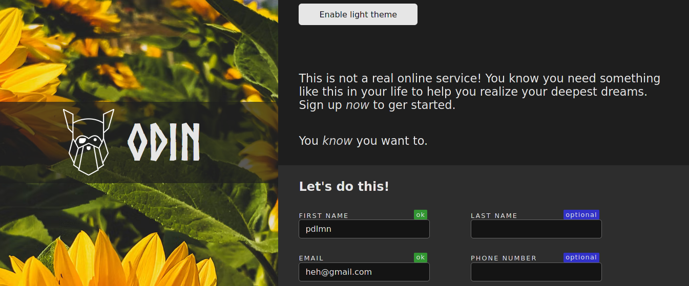

# Sign-up-form

LIVE: https://pdlmn.github.io/sign-up-form/

My recreation of [this page](https://cdn.statically.io/gh/TheOdinProject/curriculum/5f37d43908ef92499e95a9b90fc3cc291a95014c/html_css/project-sign-up-form/sign-up-form.png). The point was to learn more advanced HTML/CSS concepts, like custom properties, pseudoelements and to practice writing pages.

Page uses `normalize.css`. Not mobile-responsive, but has light-dark theme toggler.
